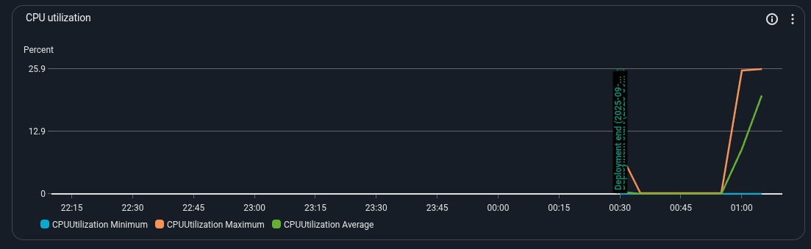
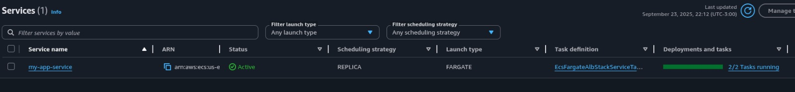
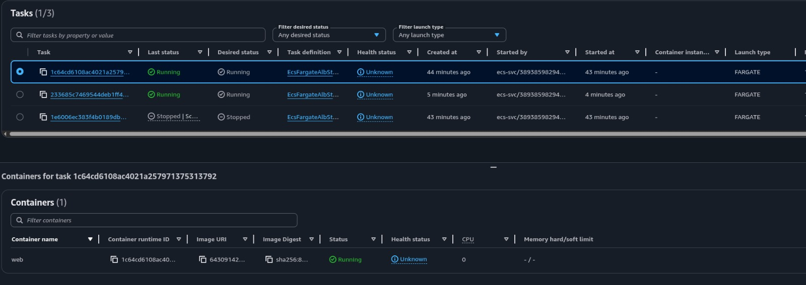

# AWS Sample: ECS + Fargate + Elastic Load Balance

This sample demonstrates how to run a containerized Node.js application on Amazon ECS with AWS Fargate, behind an internal Application Load Balancer (ALB), and exposed publicly via an Amazon API Gateway HTTP API. It also configures target tracking auto scaling on CPU and memory utilization.

## What this project creates

- VPC `my-app-vpc` with 2 AZs.
- ECS Cluster `my-app-cluster`.
- Fargate Service `my-app-service` running the container image from Amazon ECR.
- Internal ALB `my-app-alb` with health check path `/` and listener integrated to API Gateway.
- Amazon API Gateway HTTP API `my-app-api` providing a public HTTPS endpoint to the service.
- Auto scaling policies targeting 20% CPU and 20% memory (min 1, max 5 tasks, desired 2).
- Amazon ECR repository `my-app-repository` to store the container image.

Constants used across stacks:

- `PREFIX = my-app`
- ECR repository name: `my-app-repository`
- Container port: `80`

## Prerequisites

- AWS account with credentials configured (e.g., `aws configure` or environment variables).
- AWS CLI v2
- Docker
- Node.js 20+
- AWS CDK v2 (globally or via `npx`)

One-time per account/region (if not done yet):

```
npx cdk bootstrap
```

## Project layout

- Root CDK app entry: `bin/ecs-fargate-alb.ts`
- Stacks:
  - `lib/repository-stack.ts` (creates ECR repo)
  - `lib/ecs-fargate-alb-stack.ts` (VPC, ECS, ALB, API, scaling)
- Container app: `container/` (TypeScript Express server, listens on `:80`)

## Build, push image, and deploy

The Fargate service pulls `latest` from ECR. To avoid failed task starts, create the ECR repo first, push the image, then deploy the service.

1) Install dependencies (root and container):

```
npm install
cd container && npm install && cd ..
```

2) Deploy the ECR repository stack (creates `my-app-repository`):

```
npx cdk deploy RepositoryStack
```

3) Build the container app and push to ECR (replace `<account>` and `<region>`):

```
cd container

# Compile TypeScript
npm run node:build

# Authenticate Docker to ECR
aws ecr get-login-password --region <region> \
  | docker login --username AWS --password-stdin <account>.dkr.ecr.<region>.amazonaws.com

# Build and tag
docker build -t my-app-repository:latest .
docker tag my-app-repository:latest <account>.dkr.ecr.<region>.amazonaws.com/my-app-repository:latest

# Push
docker push <account>.dkr.ecr.<region>.amazonaws.com/my-app-repository:latest

cd ..
```

4) Deploy the service stack (VPC, ECS, ALB, API Gateway):

```
npx cdk deploy EcsFargateAlbStack
```

If you use a non-default AWS profile, append `--profile <your-profile>` to the CDK and AWS CLI commands.

## Get the public endpoint

This project creates an Amazon API Gateway HTTP API in front of an internal ALB. After deployment, retrieve the API endpoint:

```
aws apigatewayv2 get-apis --region <region> \
  --query "Items[?Name=='my-app-api'].ApiEndpoint" --output text
```

You should see an endpoint like:

```
https://abc123.execute-api.<region>.amazonaws.com
```

## Generate load to see auto scaling

The script at `container/src/script.ts` continuously fires concurrent GET requests to help you reach the scaling thresholds.

1) Edit the target in `container/src/script.ts`:

```
const TARGET = "https://abc123.execute-api.<region>.amazonaws.com/"
```

2) Run the script (pick one):

- Using ts-node from the repository root:

```
npx ts-node container/src/script.ts
```

- Or compile and run with Node.js:

```
cd container
npm run node:build
node build/script.js
```

When CPU or memory utilization reaches ~20%, ECS will scale out up to 5 tasks. Health checks use path `/`.

## Evidence: CPU Utilization and Auto Scaling

Below are screenshots captured during load generation using `container/src/script.ts`, demonstrating scaling behavior around the 20% CPU target and the resulting task count changes.

- CPU Utilization



- Auto Scaling (Scale Out Events)




## Clean up

To destroy all stacks:

```
npx cdk destroy --all
```

Then manually delete the ECR repository or images if CloudFormation cannot delete a non-empty repository.

## Troubleshooting

- If tasks fail to start with `IMAGE_NOT_FOUND`, ensure you pushed `latest` to `my-app-repository` in the correct account/region before deploying the service.
- The ALB is internal (`publicLoadBalancer: false`). External access must go through the API Gateway HTTP API endpoint.
- Make sure Docker is logged in to ECR in the same region you are deploying.

## Notes

- Auto scaling targets 20% CPU and 20% memory: see `lib/ecs-fargate-alb-stack.ts`.
- You can adjust names and capacity by changing `PREFIX` or scaling config in the stack files.
